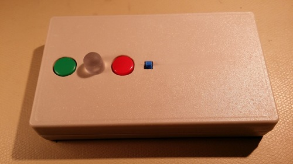

Washear
=======

Washear is a basic device for detecting when a washing machine has started
washing and blinking an LED until it's turned off. It's only using basic
analog and digital components, not an MCU. It's attached to the surface of a
washing machine using embedded magnets and rubber backing.

The purpose of this device is to workaround the issue with some washing
machines where they completely shutdown after finishing a cycle, leaving no
indication that it was started. This prevents the washed clothes being
forgotten inside and acquiring a moldy smell.

